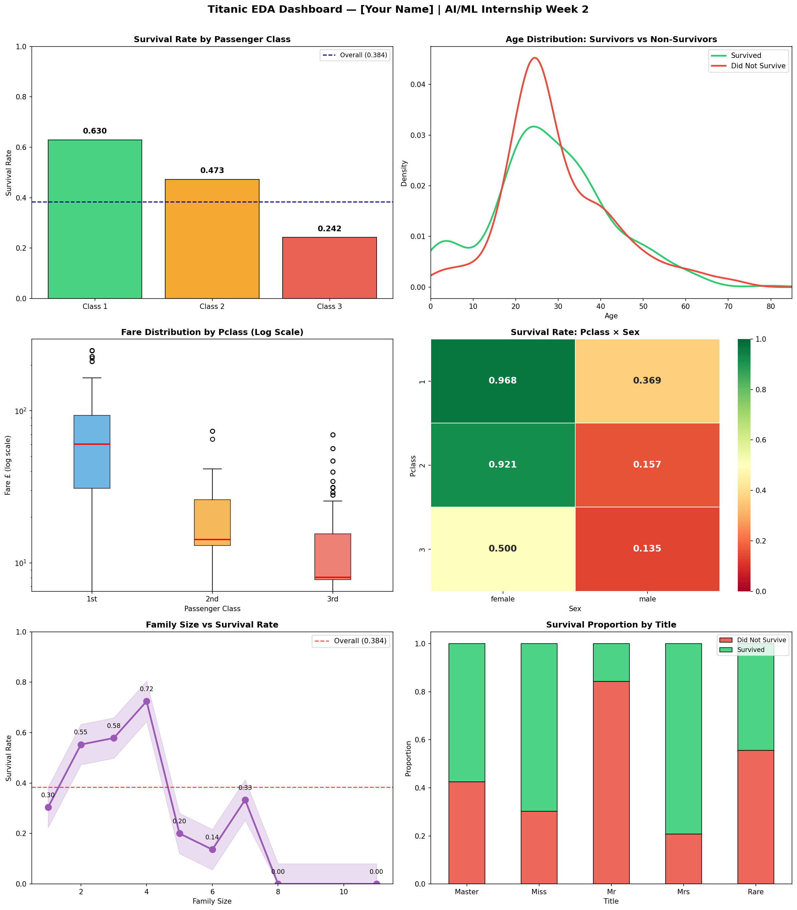

# AI/ML Internship — Week 2: Titanic EDA
**Student:** [Haya Amir]
**Dataset:** Titanic train.csv — 891 rows, 12 columns

## Top 3 Survival Insights
1. Sex is the #1 predictor: females survived at 74.2% vs males 18.9%
2. Class gradient: 1st class (62.9%) vs 3rd class (24.2%)
3. Solo travelers survived less (~30%) than small families (~55%)

## Tools
Python | NumPy | Pandas | Matplotlib | Seaborn | Scikit-learn | Colab

## Dashboard

